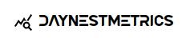
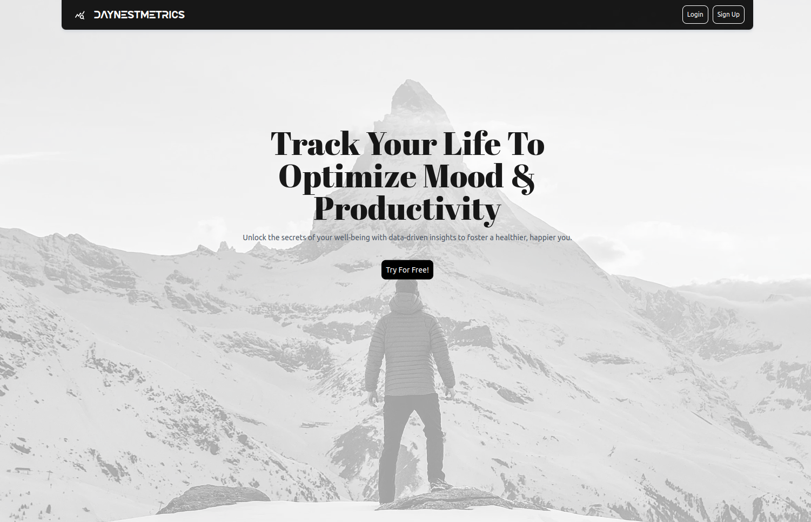
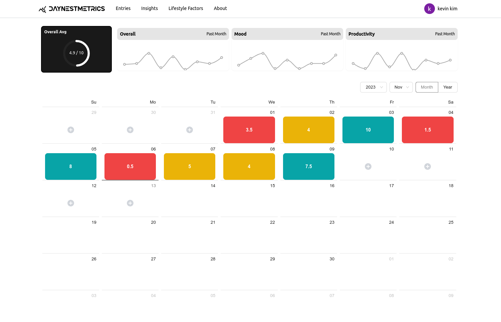
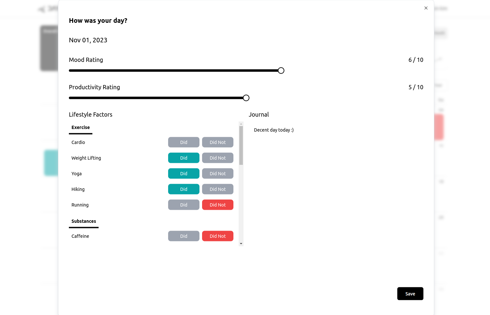
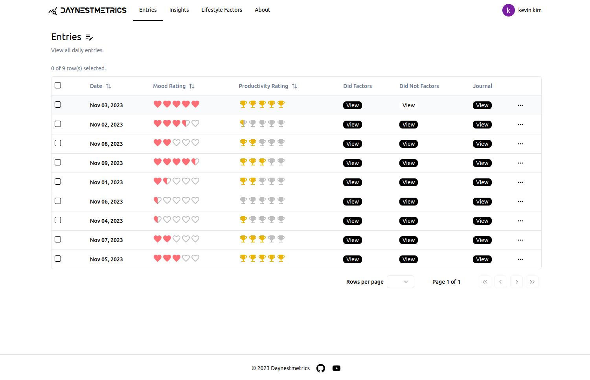
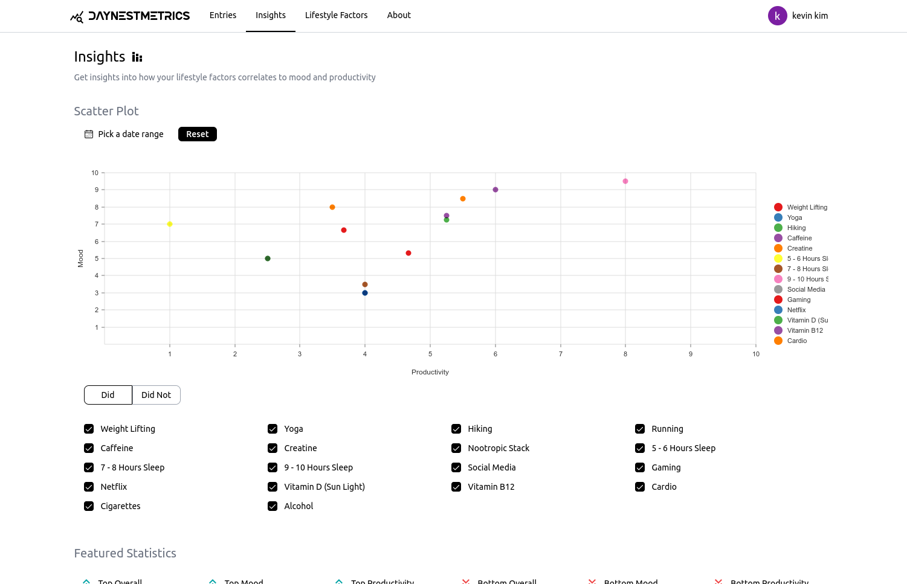
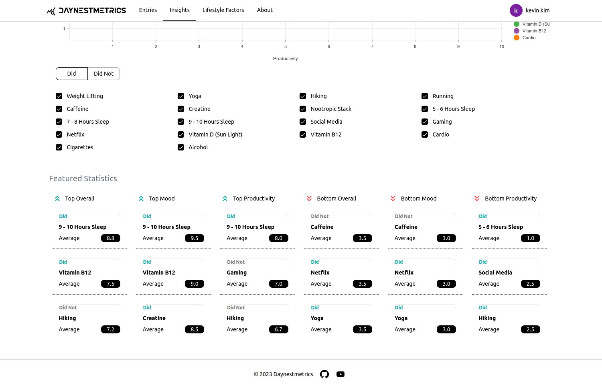
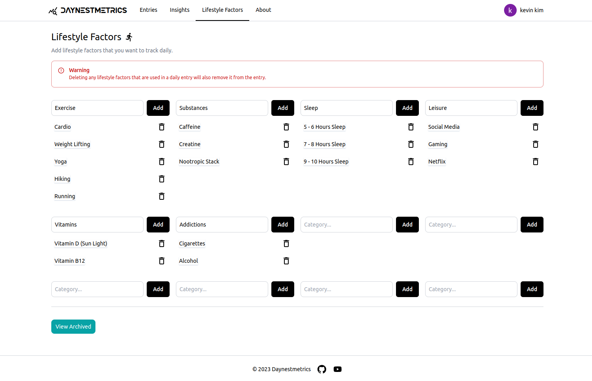
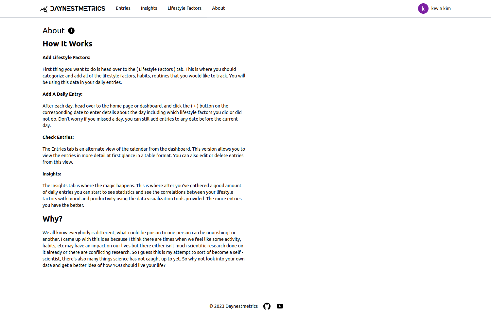

#Daynestmetrics

Website: https://daynestmetrics.up.railway.app/

It's completely free at the moment, just login with a google account and try it out!

Check my demo video of the application here : https://www.youtube.com/watch?v=KnOYuX3RQzY

## Tech Stack

- **Front End:** Next.js | TypeScript | TailwindCSS
- **Back End:** PostgreSQL
- **Other Libraries:** Shadcn UI

## Goal

I've often dreamed of a tool that could monitor both my emotional state and productivity daily, aiming to uncover any lifestyle patterns that might influence them over time. Sure, science is great, but it's still limited, and there's still a lot we don't know yet. Correlation is not causation, but it can give you insights and data points to help you make an informed decision for yourself.

## Key Features 

- Calendar and table view to browse your daily journal entries.

- Lots of data visualizations.

- Add, delete, edit lifestyle factors.

- Authentication using Auth0.

## What I learned

- While creating the db schemas using PostgreSQL, I had to make sure to add ON DELETE CASCADE option to some tables' foreign keys so that if the referenced row was deleted, it would delete all rows of with matching keys.

- Learned how to use Next.js app router. I really enjoyed the semi-opinionated architecture and the API routes made it really easy to create endpoints for the application.

- For the calendar component, I used material UI as the core component and built on top of it to add additional features and styling to make it my own.

## Project Images

**Landing Page**

This is the landing page for my web application.



**Dashboard**

This is the dashboard, in the calendar component you can press on the + circles if there isn't already an entry in order to create one for that day.



**Entry Dialog**

This is the entry dialog form where you can fill out and submit your daily entry. There's 2 sliders to measure your mood and productivity, as well as the lifestyle factors you did or did not partake in that day. You can also add a journal entry as well.



**Entries**

In the entries page you have a table view of all of your daily entries.
You can edit, delete, and delete selected rows.



**Insights**

The Insights tab is where the magic happens. This is where after you've gathered a good amount of daily entries you can start to see statistics and see the correlations between your lifestyle factors with mood and productivity using the data visualization tools provided. The more entries you have the better. The main visualization you see here is a scatter plot.



**Insights 2**

The bottom section of this page shows the most significant positive or negative correlated lifestyle factors.



**Lifestyle Factors**

This page is where you should categorize and add all of the lifestyle factors, habits, routines that you would like to track. This data will be used in your daily entries. You can add and delete factors. 

I set up an archive system as a safety measure incase the user just wanted to get rid of a factor temporarily, as fully deleting it can potentially remove a significant amount of data that would have taken a long time to build.




## How To Use



## Setup

Installation: 

```bash
git clone git@github.com:sycodes95/daynestmetrics.git
```

Install Dependencies: 

```bash
npm install
```

Running Dev Server:

```bash
npm run dev
```

Running Prod Server:

```bash
npm run build
npm start
```
